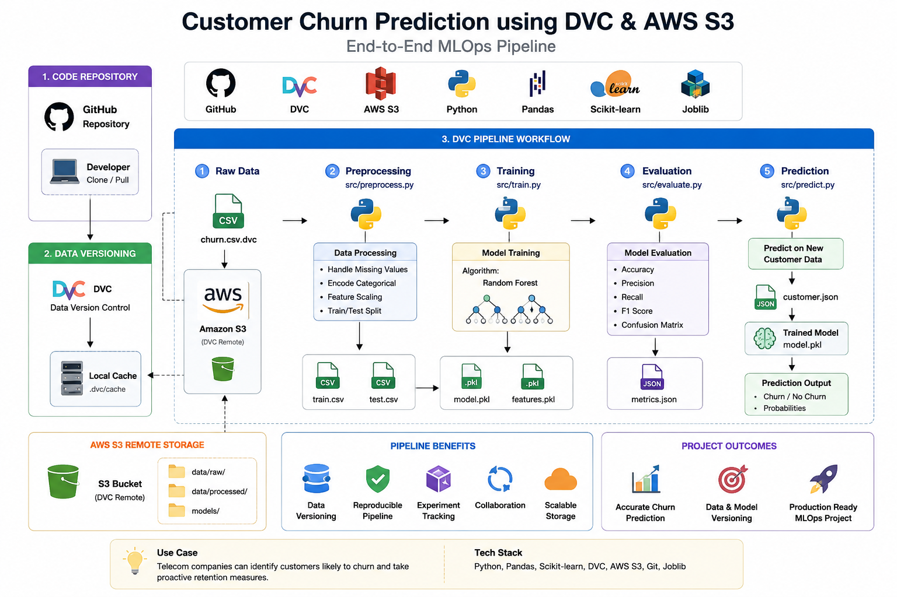

## Architecture




# Customer Churn Prediction using DVC & AWS S3

An end-to-end MLOps project demonstrating **Data Version Control (DVC)**, **AWS S3 remote storage**, **Machine Learning pipeline automation**, and **Customer Churn Prediction** using Scikit-learn.

---

## Project Overview

This project predicts whether a telecom customer is likely to churn using a Random Forest classifier.

Instead of storing datasets and trained models directly in Git, the project uses **DVC (Data Version Control)** with **Amazon S3** as the remote storage backend.

The entire ML workflow is automated through a reproducible DVC pipeline.

---

## Features

- Dataset Versioning using DVC
- AWS S3 as DVC Remote Storage
- Automated ML Pipeline
- Data Preprocessing
- Random Forest Model Training
- Model Evaluation
- Prediction on New Customer Data
- Parameterized Pipeline using `params.yaml`
- Reproducible Experiments

---

## Technology Stack

| Category | Technology |
|----------|------------|
| Language | Python |
| Version Control | Git |
| Data Versioning | DVC |
| Remote Storage | AWS S3 |
| Machine Learning | Scikit-learn |
| Data Processing | Pandas |
| Serialization | Joblib |

---

## Project Structure

```text
customer-churn-dvc-mlops/

│
├── data/
│   ├── raw/
│   └── processed/
│
├── models/
│   ├── model.pkl
│   └── features.pkl
│
├── reports/
│   └── metrics.json
│
├── sample_data/
│   └── customer.json
│
├── src/
│   ├── preprocess.py
│   ├── train.py
│   ├── evaluate.py
│   └── predict.py
│
├── dvc.yaml
├── dvc.lock
├── params.yaml
├── requirements.txt
└── README.md
```

---

## ML Pipeline

```text
Raw Dataset
     │
     ▼
preprocess.py
     │
     ▼
train.csv
test.csv
     │
     ▼
train.py
     │
     ▼
model.pkl
     │
     ▼
evaluate.py
     │
     ▼
metrics.json
     │
     ▼
predict.py
     │
     ▼
Customer Prediction
```

---

## Clone Repository

```bash
git clone https://github.com/prema-sagar/customer-churn-dvc-mlops.git

cd customer-churn-dvc-mlops
```

---

## Install Dependencies

```bash
pip install -r requirements.txt
```

---

## Retrieve Dataset from DVC Remote

```bash
dvc pull
```

---

## Execute Complete Pipeline

```bash
dvc repro
```

---

## Run Prediction

```bash
python3 src/predict.py
```

---

## Sample Output

```text
Prediction Result

Customer is likely to CHURN

Probability of staying : 48.50%

Probability of churn : 51.50%
```

---

## Evaluation Metrics

```text
Accuracy  : 79.63%

Precision : 66.04%

Recall    : 47.45%

F1 Score  : 55.23%
```

---

## Skills Demonstrated

- Machine Learning Pipeline
- Data Version Control (DVC)
- AWS S3 Integration
- Git & GitHub
- Pipeline Automation
- Model Versioning
- Data Versioning
- Python
- Scikit-learn
- MLOps Fundamentals

---

## Future Improvements

- Docker Support
- GitHub Actions CI/CD
- FastAPI REST API
- MLflow Experiment Tracking
- Kubernetes Deployment
- Model Monitoring

---

## Author

**Prema Sagar**

GitHub: https://github.com/prema-sagar

